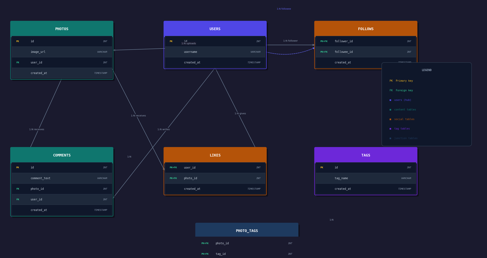

# Instagram SQL Clone: Relational Database Architecture & Analytics

 

## 📌 Executive Summary
A fully normalized relational database mirroring Instagram's core architecture. This project demonstrates backend schema design, data integrity enforcement, and the execution of complex, business-driven analytical queries. By translating raw data into actionable metrics, this repository highlights the foundational data engineering required to feed recommendation algorithms and user engagement models.

## 🏗️ Entity-Relationship (ER) Architecture
The database is structured to handle critical social media operations, utilizing composite primary keys and foreign key constraints to ensure strict referential integrity.



**Core Tables:**
* `users`: Core profile directory.
* `photos`: Content repository.
* `comments` & `likes`: User engagement mapping.
* `follows`: Network and algorithmic feed foundation.
* `tags` & `photo_tags`: Content categorization and trending topic mapping.

<details>
<summary><b>📂 Click to view Schema Creation & Data Insertion Proofs</b></summary>
<br>


</details>

---

## 📊 Analytical Challenges & Business Solutions
Rather than executing basic CRUD operations, the queries in this repository are framed around solving real-world corporate challenges. 

### 1. Bot Detection & Data Integrity
* **The Business Problem:** Fake accounts skew engagement metrics and negatively impact recommendation engines.
* **The Algorithmic Approach:** Engineered an automated query utilizing nested subqueries and `HAVING` clauses to flag accounts with a 100% like-rate (users who have liked every single photo on the platform).
* **Impact:** Ensures clean, reliable data extraction for user engagement and machine learning models.

**Query Execution & Results:**
<br>


### 2. User Engagement & Retention
* **The Business Problem:** Identifying drop-off points and optimizing marketing budgets.
* **The Algorithmic Approach:** Utilized `LEFT JOINS` (anti-joins) to isolate "ghost users" who registered but never posted, providing a clean cohort for targeted email re-engagement campaigns. Aggregated registration timestamps using `DAYNAME()` to identify peak weekly traffic. 
* **Impact:** Provides actionable metrics to marketing and growth teams to improve overall platform retention rates.

**Query Execution & Results:**
<br>

<br>

<br>

<br>

<br>


### 3. Algorithmic Content Tagging
* **The Business Problem:** Ad-targeting and feed generation rely on surfacing trending topics.
* **The Algorithmic Approach:** Executed multi-table `JOINS` and aggregations to calculate hashtag frequency, surfacing the top 5 most utilized tags across the network.
* **Impact:** Simulates the data extraction process required to build dynamic, real-time trending feeds.

**Query Execution & Results:**
<br>


---

## 🗂️ Repository Structure

```text
├── README.md
├── schema_design/
│   ├── 1_create_tables.sql
│   └── 2_insert_mock_data.sql
├── analytical_queries/
│   ├── user_engagement.sql
│   ├── bot_detection.sql
│   └── hashtag_trends.sql
└── assets/
    ├── banner_placeholder.png
    └── instagram_clone_erd.png
